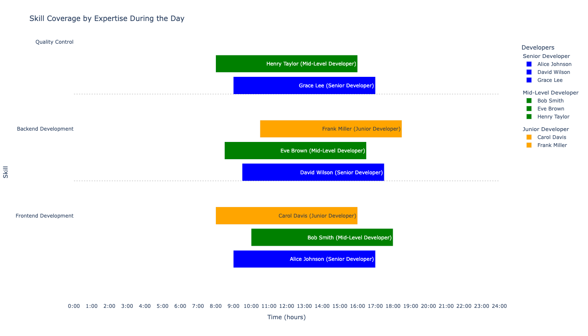
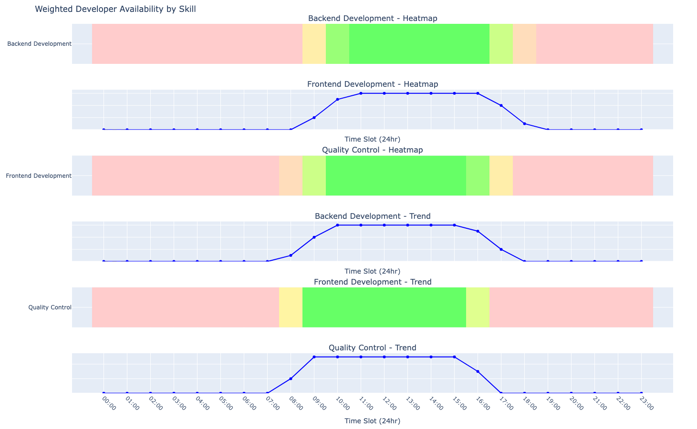
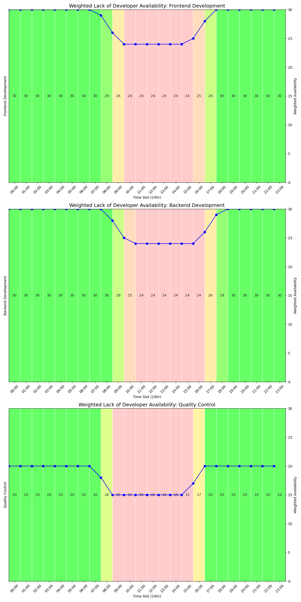
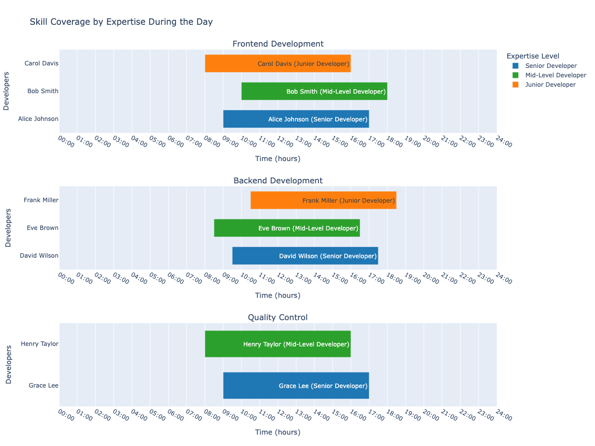

# Team Skill Coverage Visualization

## Overview

This project provides a comprehensive suite of visualization tools for analyzing team skill coverage across different time zones. It generates detailed, interactive charts that illustrate the distribution and availability of team members over a 24-hour period, offering valuable insights into team dynamics and skill distribution.

## Features

- **Multiple Visualization Options**: Includes various chart types for different analytical perspectives.
- **Time Zone Visualization**: Displays team coverage across multiple time zones for global team coordination.
- **Skill-Based Grouping**: Groups team members by their skills, providing a clear view of skill distribution.
- **Interactive Charts**: Offers visually appealing, interactive charts for enhanced understanding of team dynamics.
- **Customizable**: Easily adaptable YAML configuration to reflect specific team structures and time zones.
- **Weighted Scoring**: Uses expertise-based weights to calculate more accurate skill coverage.

## Getting Started

### Prerequisites

- Python 3.8+
- pip (Python package installer)

### Installation

1. Clone the repository:
   ```bash
   git clone https://github.com/yourusername/team-skill-coverage-visualization.git
   ```

2. Navigate to the project directory:
   ```bash
   cd team-skill-coverage-visualization
   ```

3. Install the required Python libraries:
   ```bash
   pip install -r requirements.txt
   ```

## Usage

### Configuration

Update the `team_data.yaml` file with your team's schedule, skills, and expertise weights. The file should be structured as follows:

```yaml
Frontend Development:
  Alex Johnson:
    start: "1:30 AM"
    end: "10:30 AM"
    expertise: "Senior Developer"
  ...
Backend Development:
  ...

Weights:
  Junior Developer: 1
  Mid-level Developer: 2
  Senior Developer: 3
  Team Lead: 4
```

### Scoring Calculation

The scoring system uses weights to calculate the skill coverage based on team members' expertise levels. Here's how it works:

1. Each expertise level is assigned a weight (e.g., Junior: 1, Mid-level: 2, Senior: 3, Team Lead: 4).
2. For each hour, the script calculates the total weighted score by summing the weights of all available team members.
3. This weighted score represents the skill coverage for that particular hour.
4. The resulting charts display these weighted scores, providing a more accurate representation of the team's skill distribution and availability.

### Updating Weights

To update the expertise weights:

1. Open the `team_data.yaml` file.
2. Locate the `Weights` section at the bottom of the file.
3. Modify the values associated with each expertise level as needed.
4. Save the file.

Example:
```yaml
Weights:
  Junior Developer: 1
  Mid-level Developer: 2.5
  Senior Developer: 4
  Team Lead: 5
```

After updating the weights, re-run the chart generation scripts to see the updated visualizations reflecting the new scoring.

### Generating Charts

1. **24-Hour Skill Coverage (One Glance)**
   ```bash
   python "24H Skill Coverage - One Glance.py"
   ```

2. **24-Hour Skill Coverage with Linear Trend (Plotly)**
   ```bash
   python "24H Skill Coverage - Included Linear Trend - Plotly.py"
   ```

3. **24-Hour Skill Coverage with Linear Trend (Seaborn)**
   ```bash
   python "24H Skill Coverage - Included Linear Trend - Seaborn.py"
   ```

4. **24-Hour Skill Coverage Separated by Groups**
   ```bash
   python "24H Skill Coverage - Separated by Groups.py"
   ```

Each script will generate and display its respective chart. For Plotly-based charts, an interactive HTML file will be saved in the `plots` directory.

## Chart Types and Their Uses

1. **One Glance Chart**: Provides a quick overview of all skills and team members in a single view.
2. **Linear Trend Charts**: Show the weighted availability of skills over time, useful for identifying peak hours and potential gaps.
3. **Separated by Groups Chart**: Offers a detailed view of each skill group, making it easier to analyze specific team compositions.

## Plot Screenshots

(Add your plot screenshots here with brief descriptions)


*Figure 1: 24-Hour Skill Coverage at One Glance*


*Figure 2: 24-Hour Skill Coverage with Linear Trend (Plotly)*


*Figure 3: 24-Hour Skill Coverage with Linear Trend (Seaborn)*


*Figure 4: 24-Hour Skill Coverage Separated by Groups*

## Contributing

Contributions are welcome! Please feel free to submit a Pull Request.

1. Fork the repository
2. Create your feature branch (`git checkout -b feature/AmazingFeature`)
3. Commit your changes (`git commit -m 'Add some AmazingFeature'`)
4. Push to the branch (`git push origin feature/AmazingFeature`)
5. Open a Pull Request

## License

This project is licensed under the MIT License - see the [LICENSE](LICENSE) file for details.

## Acknowledgments

- Thanks to all contributors who have helped shape this project.
- Special thanks to the Plotly, Seaborn, and Matplotlib communities for their excellent visualization libraries.
